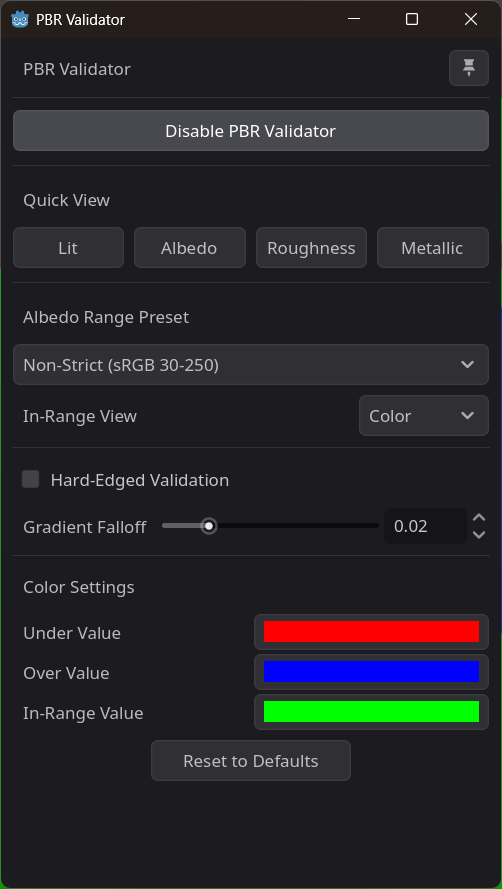
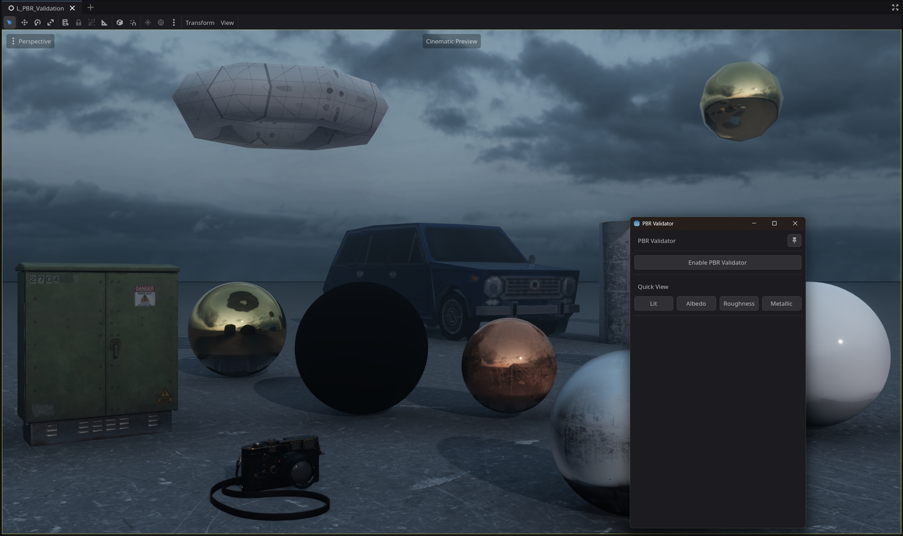

# PBR Validator for Godot 4

PBR Validator is a Godot 4 editor plugin that helps you validate your PBR materials in real-time. It provides a dock with various validation modes and options to quickly identify issues with your materials.

<table width="100%">
  <tr>
    <td width="75%" align="center">
      
    </td>
    <td width="25%" align="center">
      
    </td>
  </tr>
</table>

## Table of Contents

- [Features](#features)
- [Installation](#installation)
- [Quick Start](#quick-start)
- [Limitations](#limitations)
- [Contributing](#contributing)
- [License](#license)

## Features

-   **Albedo Validation**: Check if your albedo values are within the recommended range for PBR.
-   **Roughness Validation**: Visualize roughness values and identify extremes.
-   **Metallic Validation**: Visualize metallic values.
-   **Real-time Updates**: The validation is updated in real-time as you modify your materials.
-   **Customizable**: Customize the validation colors, ranges, and more.
-   **Dockable and Floating Window**: The UI can be docked in the editor or used as a floating window.

## Installation

1.  Clone this repository or download the latest release.
2.  Copy the `pbr_validator` folder into your Godot project's `addons` folder.
3.  Enable the plugin in your project's `Project Settings > Plugins` tab.

## Quick Start

1.  Once the plugin is enabled, you will see a new dock on the right side of the editor.
2.  Click the "Enable PBR Validator" button to activate the validation mode.
3.  Use the "Mode" dropdown to select the validation mode you want to use.
4.  Use the quick view buttons to quickly switch between different validation modes.

For more detailed information, please refer to the [DOCUMENTATION.md](pbr_validator/DOCUMENTATION.md) file.

## Limitations

-   Currently, the PBR Validator only works with materials that use Godot's built-in PBR shader (`StandardMaterial3D` and `ORMMaterial3D`). Custom shaders are not supported out of the box and require modifications to the validator's shader code.
-   The plugin has not been tested in large-scale scenes and may have performance issues in projects with a high number of materials.

## Contributing

Contributions are welcome! If you find a bug or have a feature request, please open an issue on the GitHub repository. If you would like to contribute code, please open a pull request.

## License

This project is licensed under the GPL-3.0 License. See the [LICENSE](LICENSE) file for details.
