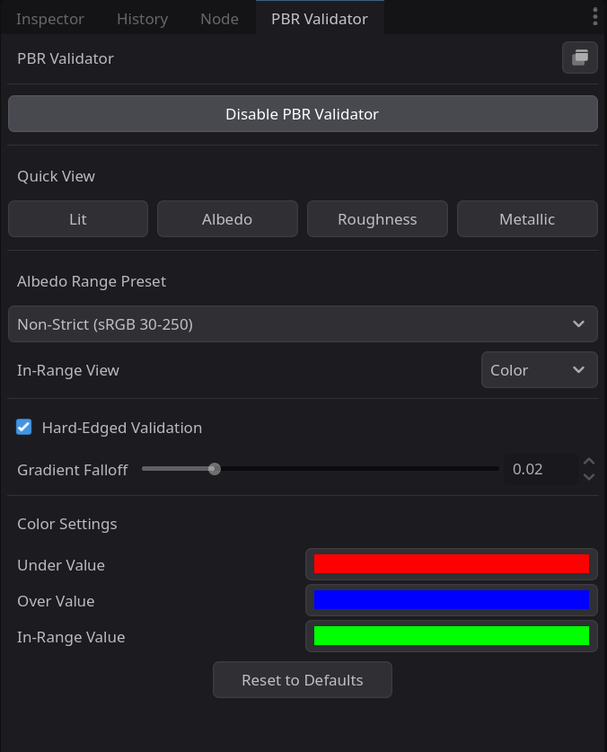

# PBR Validator for Godot 4

A Godot 4 editor plugin to validate PBR material values directly in the viewport, helping you ensure your materials are authored correctly for physically-based rendering.

*Test Scene above not included.*

## Table of Contents

- [Features](#features)
- [Installation](#installation)
- [Compatibility](#compatibility)
- [UI Overview](#ui-overview)
- [Core Functionality](#core-functionality)
  - [Enable PBR Validator Button](#enable-pbr-validator-button)
  - [Quick View Buttons](#quick-view-buttons)
- [Mode-Specific Settings](#mode-specific-settings)
  - [Albedo Settings](#albedo-settings)
  - [Roughness Settings](#roughness-settings)
- [Known Limitations](#known-limitations)
- [Docking and Undocking](#docking-and-undocking)
- [License](#license)

## Features

-   **Albedo Validation**: Check that dielectric albedo values are within physically-plausible ranges.
-   **Quick View Modes**: Isolate and view unlit Albedo, Roughness, and Metallic channels.
-   **Customizable Ranges**: Use strict or non-strict presets for albedo, or define your own custom range.
-   **Customizable Visuals**: Change the validation highlight colors to your preference.
-   **Dockable & Floating UI**: Use the panel as a dockable UI or a floating window.

## Installation

1.  Navigate to the `addons/` folder in your Godot project. If you don't have one, create it.
2.  Copy the `pbr_validator` folder into the `addons/` folder.
3.  Go to `Project -> Project Settings -> Plugins` in Godot and enable the "PBR Validator" plugin.

## Compatibility

-   This plugin is compatible with **Godot 4.x**.
-   The current material-override method works best with Godot's default `StandardMaterial3D` and `ORMMaterial3D`.

## UI Overview

The PBR Validator UI is located in a dock on the right side of the editor. It can also be undocked and used as a floating window.

The UI consists of the following main elements:

-   **Enable PBR Validator Button**: The primary button to activate detailed Albedo validation and access its settings.
-   **Quick View Buttons**: A set of buttons to quickly switch between different unlit debug views (Lit, Albedo, Roughness, Metallic).
-   **Options Containers**: Panels that appear below the buttons to show the settings for the currently active validation mode (e.g., Albedo or Roughness).

## Core Functionality

### Enable PBR Validator Button

This is the main toggle for the tool.

-   **Toggling ON**: Activates the **Albedo Validation** mode. This is the most detailed mode, designed to check if your albedo values are within a physically correct range. When enabled, the "Albedo Settings" panel will appear.
-   **Toggling OFF**: Disables any active validation mode and returns the viewport to the standard lit view.

### Quick View Buttons

These buttons provide a fast way to switch to simple, unlit debug views. Activating any of these will enable the validator in the background.

<table width="100%">
  <tr>
    <td width="25%" align="center">
      
    </td>
    <td width="25%" align="center">
      
    </td>
    <td width="25%" align="center">
      
    </td>
    <td width="25%" align="center">
      
    </td>
  </tr>
</table>

-   **Lit**: This is not a validation mode. Pressing it disables any active validation and returns the viewport to the standard lit view.
-   **Albedo**: Shows the final, unlit albedo/base color of your materials. This is useful for checking color and texture work without the influence of lighting.
-   **Roughness**: Shows the final roughness value as a greyscale map (Black=0.0, White=1.0).
-   **Metallic**: Shows the final metallic value as a greyscale map (Black=0.0, White=1.0).

## Mode-Specific Settings

When certain modes are active, a panel with specific settings will appear.

### Albedo Settings

This panel appears when the **Enable PBR Validator** button is active.

-   **Albedo Preset**: Choose a preset for common dielectric albedo validation ranges.
    -   *Strict (sRGB 50-243)*: A strict range for non-metals based on common PBR guidelines.
    -   *Non-Strict (sRGB 30-250)*: A more relaxed range for artistic flexibility.
    -   *Custom*: Allows you to define your own min/max range.
-   **Custom Albedo**: Sliders and spin-boxes to set the custom min/max albedo range (in sRGB 0-255).
-   **In-Range View**: Choose how to display pixels that are within the valid albedo range.
    -   *Greyscale*: Shows the original luminance of the albedo.
    -   *Color*: Replaces the valid areas with a custom color.
-   **Gradient Falloff**: Controls the softness of the gradient at the validation boundaries. Lower values are sharper.
-   **Hard-Edged Validation**: A checkbox to disable the gradient, showing a sharp pass/fail for out-of-range values.
-   **Color Settings**: Pickers to set the colors for highlighting values that are too dark (`Under Value`), too bright (`Over Value`), or for replacing valid values (`In-Range Value`) when the In-Range View is set to "Color".
-   **Reset to Defaults**: A button to reset all Albedo settings to their original values.

### Roughness Settings

This panel appears when the **Roughness** quick view is active.

-   **Highlight Extreme Values**: A checkbox to highlight roughness values that are pure black (0.0) or pure white (1.0), which are often undesirable.
-   **Highlight Color**: A color picker to set the color for the highlighted extremes.
-   **Reset to Defaults**: A button to reset all Roughness settings to their original values.

## Known Limitations

-   The current validation method works by reading the parameters of a material (`albedo_texture`, `roughness`, etc.). This works perfectly for Godot's built-in `StandardMaterial3D` and `ORMMaterial3D`, but it **will not work for most custom shaders**, as the tool cannot know the unique uniform names used in those shaders.
-   A future version may use G-buffer access to solve this limitation for projects using the Forward+ renderer in Godot 4.2+.
-   The plugin has not been tested in large-scale scenes and may have performance issues in projects with a high number of materials.

## Docking and Undocking

<table width="100%">
  <tr>
    <td width="60%" align="center">
      
    </td>
    <td width="40%" align="center">
      
    </td>
  </tr>
</table>

The PBR Validator UI can be docked in the editor or used as a floating window. To undock the UI, click the "Undock Panel" button in the top right corner of the dock. To re-dock the UI, select the same button (which will now have a "Pin" icon) or simply close the floating window.

## License

This project is licensed under the GNU General Public License v3.0. See the [LICENSE](../LICENSE) file for details.